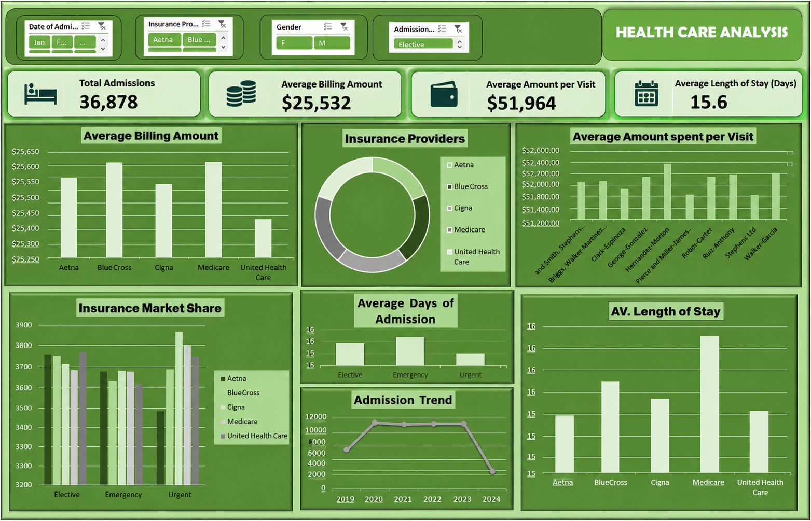

# Healthcare Analysis

## Project Overview

This project analyzes healthcare data to understand patient admission patterns, insurance coverage, healthcare costs, and length of stay. The analysis focuses on identifying patterns that can support better operational and financial decision-making.

## Business Question

How do patient admissions, insurance providers, length of stay, and healthcare costs vary across the hospital's patient population, and what patterns can be identified to support operational and financial decision-making?

## Tools Used

- Microsoft Excel
- Pivot Tables
- Pivot Charts
- Excel Slicers
## Dashboard

